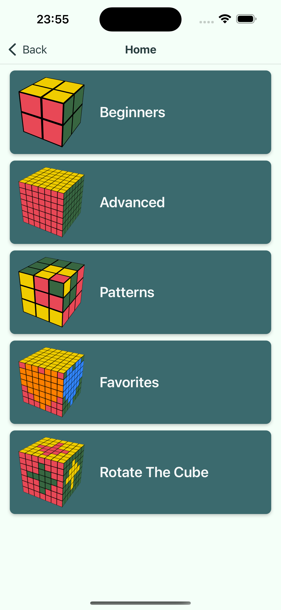
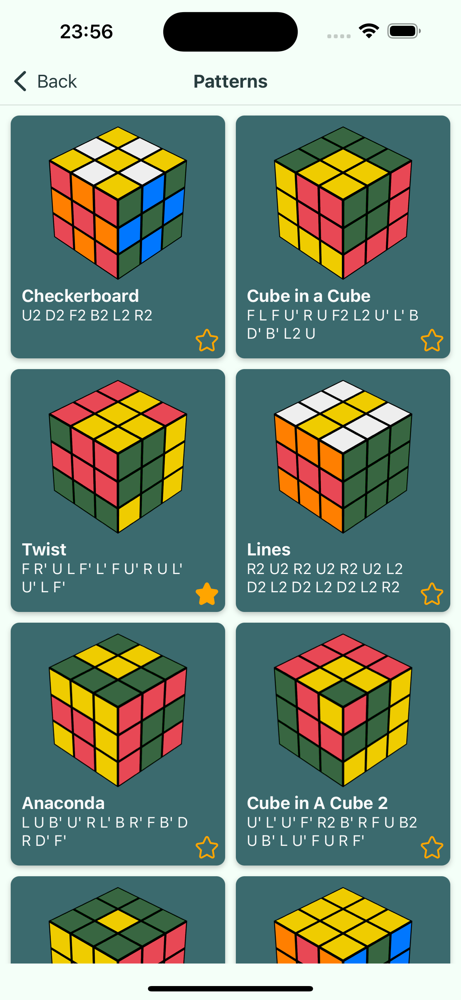
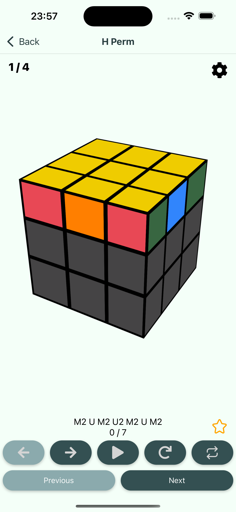
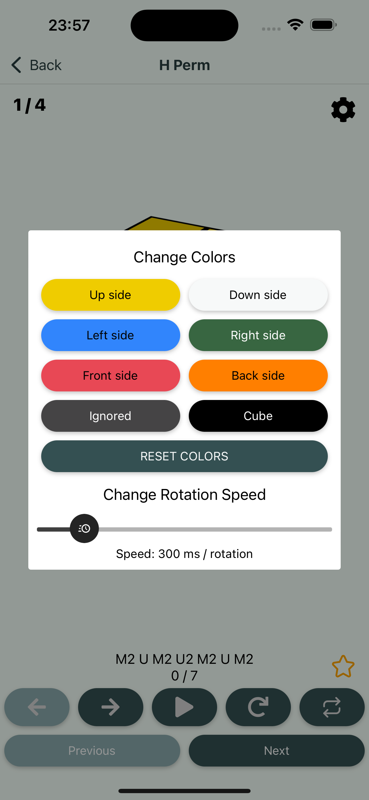

<p align="center">
  
</p>

# CubeXpert

[](https://reactnative.dev/)
[](https://docs.expo.dev/)

A cutting-edge React Native app to revolutionize your cube solving experience.

## Table of Contents

- [Features](#key-features)
- [Description](#description)
- [ScreenShots](#screenshots)
- [Run Locally](#run-locally)
- [Run It On Your Phone](#run-it-on-your-phone)
- [Tech Stack](#tech-stack)
- [Authors](#authors)


## Key Features

Unlock the secrets of the Rubik's Cube and become a master solver with CubeXpert, your ultimate guide to all things Rubik's Cube.

### Learn Rubik's Cube Algorithms

CubeXpert boasts an extensive library of algorithms designed to demystify the Rubik's Cube solving process. Each algorithm is accompanied by detailed instructions and animations, ensuring that you can easily follow along and learn at your own pace. From basic maneuvers to advanced techniques, we cover it all, making sure you have the knowledge to conquer any cube.

### Customize Your Cube Experience

We understand that cubers have their own preferences. With CubeXpert, you have the power to customize your cube's appearance and behavior. Change the colors of the cube's faces to match your style, and fine-tune the rotation speed to match your comfort level. Your cube, your way.

### Favorite Algorithms

We've made it simple for you to access your go-to algorithms whenever you need them. Add your favorite algorithms to a dedicated list for quick retrieval. No more scrolling through endless pages; with CubeXpert, you have instant access to the sequences you rely on most.

### Learn Cube Basics

If you're new to Rubik's Cube solving, CubeXpert provides beginner-friendly tutorials that break down the fundamentals step by step. Start with the basics and gradually progress to more advanced solving techniques. Our goal is to empower you with the knowledge you need to conquer the cube confidently.

### Explore Fun Cube Patterns

For those moments when you want to infuse some fun into your cubing experience, CubeXpert offers a delightful collection of entertaining cube patterns. These patterns feature unique and playful cube rotations and sequences, adding a twist to your solving journey and keeping you engaged and entertained.

## Description

CubeXpert is your comprehensive Rubik's Cube companion, whether you're a beginner looking to conquer your first cube or an experienced cuber seeking to refine your skills. Unlock the secrets of the Rubik's Cube and become a master solver with our app.

With CubeXpert, you can dive deep into the world of Rubik's Cube solving. Our app provides you with an extensive library of algorithms, complete with detailed instructions and animations. From basic maneuvers to advanced techniques, we've got you covered, ensuring that you have the knowledge to conquer any cube.

But that's not all; CubeXpert values personalization. Customize your cube's appearance and behavior to match your style and comfort level. Tired of scrolling through endless pages to find your favorite algorithms? CubeXpert allows you to save and access them with ease.

If you're new to Rubik's Cube solving, our app offers beginner-friendly tutorials that break down the fundamentals step by step, empowering you with the knowledge you need to conquer the cube confidently. And for those moments when you want to add some fun to your cubing experience, explore our entertaining cube patterns featuring unique and playful cube rotations and sequences.

Join a thriving community of cubers and embark on an exciting journey of skill-building and cube-solving exploration. Whether you aspire to become a Rubik's Cube champion, impress your friends with lightning-fast solves, or simply enjoy the satisfaction of mastering this iconic puzzle, CubeXpert is your trusted companion.

Ready to elevate your Rubik's Cube game? Download CubeXpert now and take the first step toward becoming a Rubik's Cube pro!

## ScreenShots

<p align="center">
  
  
  
  
  
  
  
  
  
  
  
  
</p>

## Run Locally

Clone the project

```bash
  git clone https://github.com/tarasovladislav/CubeXpert
```

Go to the project directory

```bash
  cd CubeXpert
```

Install dependencies

```bash
  cd Client
  npm install
```

Start the Client

```bash
  cd Client
  npm start
```

Server does not need to be started, it runs online. 

But if you want to change some backend, you have to deploy it online and change url for requests at the client side.

## Run It On Your Phone

Download Expo Go app on your phone. https://expo.dev/client

Scan QR Code below

#### iOS with your camera app: 


#### Android with Expo Go app: 


## Tech Stack

**Client:** React Native

**Server:** Express JS 

**Database:** MongoDB, Mongoose

## Authors

- [@tarasovladislav](https://www.github.com/tarasovladislav)